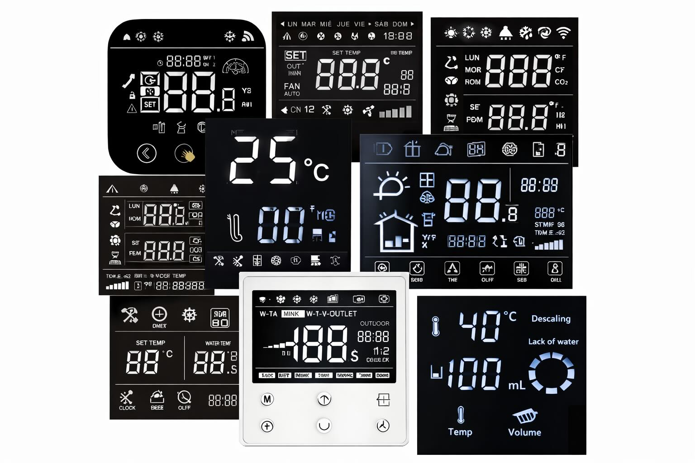
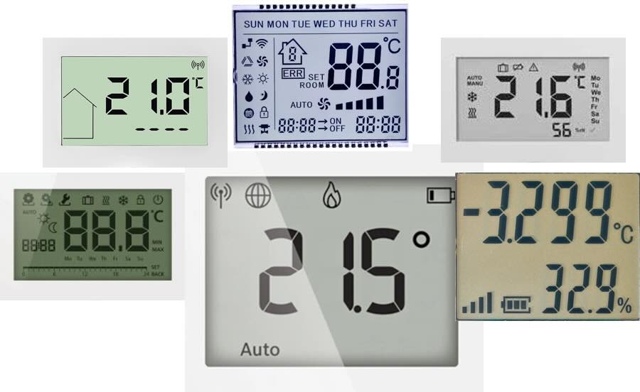
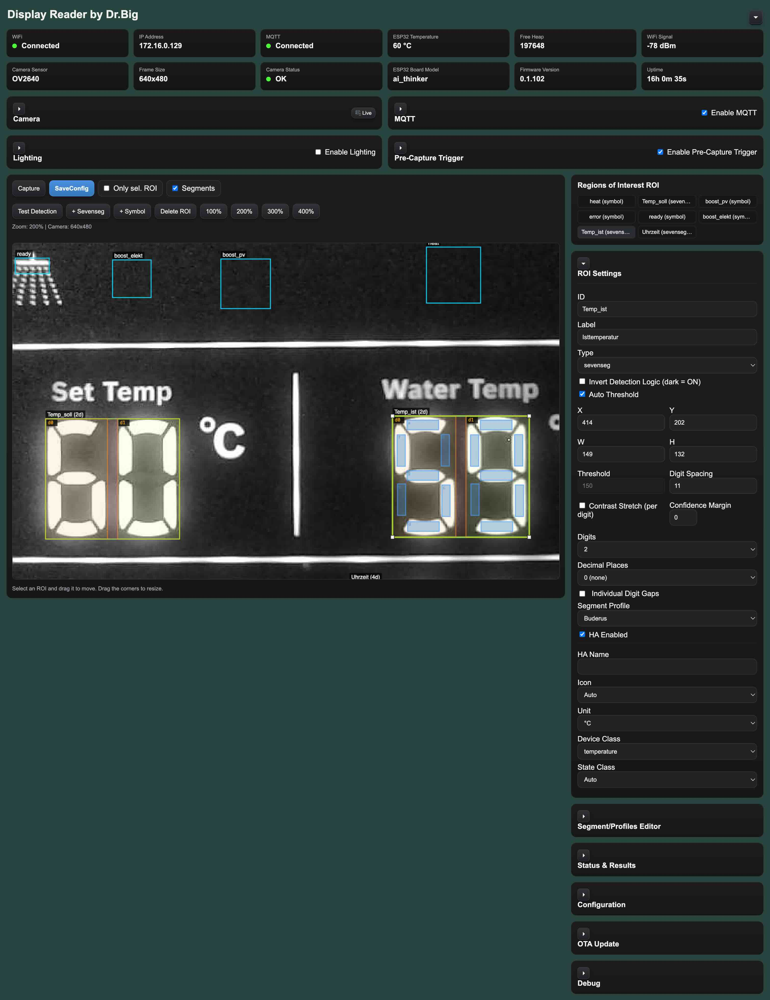
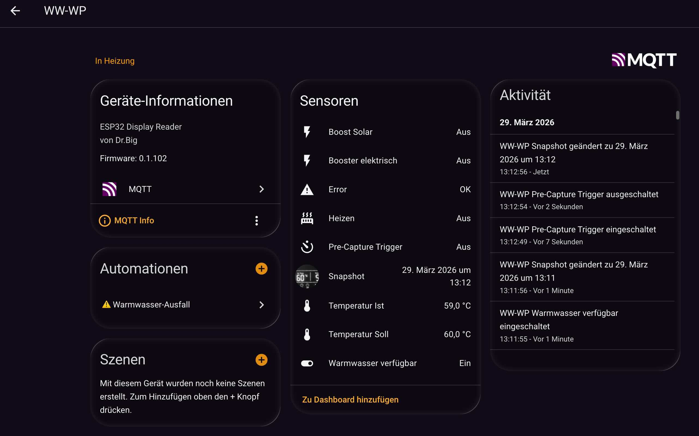

# ESP32 Display Reader

**ESP32 optical reader for 7-segment displays and symbols — with MQTT and Home Assistant integration.**

> 🇩🇪 Diese Dokumentation ist auf Deutsch verfügbar. Eine englische Version ist in Arbeit.
> 🇬🇧 English documentation is currently being prepared. This README is available in German.

---


Firmware für einen **ESP32 mit Kamera**, die Anzeigen auf Basis einer **7-Segment Darstellung optisch ausliest** und erkannte **Zahlen oder Statussymbole über MQTT** bereitstellt – mit direkter **Home Assistant Integration**.

---

Perfekt zum Auslesen **"selbstleuchtender"** Displays mit **Symbolen** und **7 Segment Darstellung** dieser Art! 

# ⏩ 



---

Bedingt geeignet zum Auslesen sogenannter ***LCD Displays***. 💡 Externe Beleuchtung notwendig!

# ⏩ 



---

# ⬇️  Display Reader



---

# ⬇️  Und das Ergebniss in HA Mqtt



---
## 📑 Inhaltsverzeichnis

- [Features](#features)
- [Unterstützte Hardware](#unterstützte-hardware)
- [Installation](#installation)
- [Dokumentation](#dokumentation)
- [Lizenz](#lizenz)

---

## Features

- 📷 Kamerabasierte Erkennung von **7-Segment Anzeigen**
- 🔢 Auslesen von **Zahlenwerten** mit konfigurierbaren Dezimalstellen
- 🔔 Erkennung von **Statussymbolen** (Ein/Aus)
- 📡 **MQTT Integration** mit konfiguriertem Publish-Intervall
- 🏠 **Home Assistant Auto Discovery** (Sensoren automatisch als Entitäten)
- 💡 Steuerung einer **optionalen Beleuchtung** (PWM, GPIO-konfigurierbar)
- 🌈 Zweiter Beleuchtungskanal für **WS2812B LED** (NeoPixel, unabhängig steuerbar)
- 🔁 **Pre-Capture Trigger** über MQTT (externe Beleuchtung, Relais, etc.)
- 🎛️ **Segment/Profiles Editor** für unterschiedliche Displaytypen
- 🌐 **Webinterface** zur vollständigen Konfiguration im Browser
- 🔄 **OTA Firmware Updates** direkt über das Webinterface
- 📤 **Export / Import** der Konfiguration als JSON-Datei

---

## Unterstützte Hardware

Der verwendete ESP32 **muss PSRAM besitzen**, da für die Bildverarbeitung zusätzlicher Arbeitsspeicher benötigt wird.

Aktuell unterstützte Boards:

| Board | Status |
|-------|--------|
| ESP32-CAM (AI-Thinker kompatibel) | ✅ unterstützt |
| ESP32 WROVER | ✅ unterstützt |
| ESP32-S3 | 🔜 geplant |

---

## Installation

### 🚀 Web Installer

Firmware direkt im Browser flashen – kein zusätzliches Tool erforderlich:

👉 **[Web Installer starten](https://docbig.github.io/ESP32-Display-Reader/)**

### PlatformIO

```bash
git clone https://github.com/DocBig/ESP32-Display-Reader
cd esp32-display-reader
pio run -t upload
```

---

## Dokumentation

| Bereich | Beschreibung |
|---------|-------------|
| [📲 Installation und WLAN Einrichtung](docs/installation.md) | Firmware flashen und Erstkonfiguration |
| [🖥️ Webinterface](docs/webinterface.md) | Alle Bereiche der Weboberfläche im Detail |
| [📍 ROI Konfiguration](docs/roi.md) | Regions of Interest: Symbol und 7-Segment |
| [🎛️ Segment-Profile](docs/seg_profiles.md) | Eigene Segment-Layouts für verschiedene Displays |
| [🤖 Home Assistant Integration](docs/homeassistant.md) | MQTT und HA Auto Discovery Setup |
| [🧪 Test und Fehlersuche](docs/test_debug.md) | Debugging, Diagnose und Testfunktionen |

---

## Lizenz

MIT License


[⬆️ Nach oben](#esp32 display reader)

> 📷 Alle Screenshots entstanden im Zusammenspiel mit einer **Buderus WPT260.4 AS** (Logatherm Warmwasser-Wärmepumpe).
