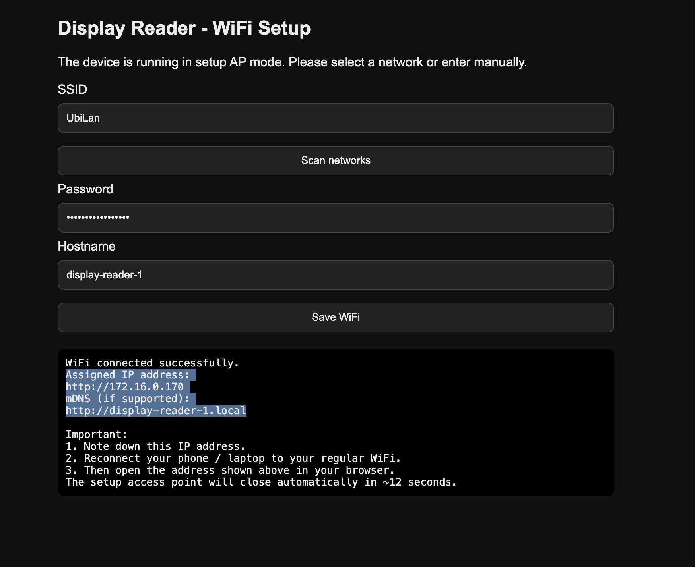

# Installation und WLAN Einrichtung

> **Navigation:** [📖 Startseite](../README.md) | → **📲 Installation** | [🖥️ Webinterface](webinterface.md) | [📍 ROI Konfiguration](roi.md) | [🎛️ Segment-Profile](seg_profiles.md) | [🤖 Home Assistant](homeassistant.md) | [🧪 Test & Debug](test_debug.md)

---

## Flashen des Images

### 🚀 Web Installer (empfohlen)

Firmware direkt im Browser flashen – kein zusätzliches Tool erforderlich:

👉 **[Web Installer starten](https://docbig.github.io/ESP32-Display-Reader/)**

1. ESP32 per USB mit dem Rechner verbinden
2. Browser öffnen (Chrome oder Edge empfohlen – Firefox unterstützt Web Serial nicht)
3. **Install** klicken und den richtigen COM-Port auswählen
4. Flash-Vorgang abwarten — der ESP32 startet automatisch neu

> ⚠️ Der Web Installer überträgt immer die aktuelle Firmware-Version.

---

### 🛠️ Manueller Flash (PlatformIO)

```bash
git clone https://github.com/DocBig/ESP32-Display-Reader
cd esp32-display-reader
pio run -t upload
```

---

### Firmware-Dateien

| Datei | Verwendung |
|-------|-----------|
| `firmware.bin` | Erstflash per USB (enthält Bootloader + Partitionstabelle) |
| `firmware-ota.bin` | OTA-Update über das Webinterface |

> ⚠️ Für OTA-Updates ausschließlich `firmware-ota.bin` verwenden. Die `firmware.bin` enthält Bootloader und Partitionstabelle und ist **nicht** für OTA geeignet — das Update schlägt mit dem Fehler `Wrong Magic Byte` fehl.

---

## Wlan einrichten

Nach dem Flashen startet das Gerät im **Access Point Modus**.

SSID:

DisplayReader-XXXX

Bitte mit dem AP verbinden und anschließend im Browser öffnen:

http://192.168.4.1



Hier werden eingestellt:

- WLAN SSID
- WLAN Passwort
- optional Hostname

Nach dem Speichern startet das Gerät neu und verbindet sich mit dem WLAN.

---

[⬆️ Nach oben](#)

> 📷 Alle Screenshots entstanden im Zusammenspiel mit einer **Buderus WPT260.4 AS** (Logatherm Warmwasser-Wärmepumpe).