# Webinterface

> **Navigation:** [📖 Startseite](../README.md) | [📲 Installation](installation.md) | → **🖥️ Webinterface** | [📍 ROI Konfiguration](roi.md) | [🎛️ Segment-Profile](seg_profiles.md) | [🤖 Home Assistant](homeassistant.md) | [🧪 Test & Debug](test_debug.md)

---

Nach erfolgreicher WLAN-Konfiguration verbindet sich das Gerät mit dem lokalen Netzwerk.
Das Webinterface ist anschließend über die zugewiesene IP-Adresse oder den konfigurierten Hostnamen erreichbar.

```
http://display-reader.local
```

Das Webinterface ermöglicht die **vollständige Konfiguration und Diagnose** des ESP32 Display Readers direkt im Browser – ohne zusätzliche Software.

---

## 0 – Gesamtübersicht

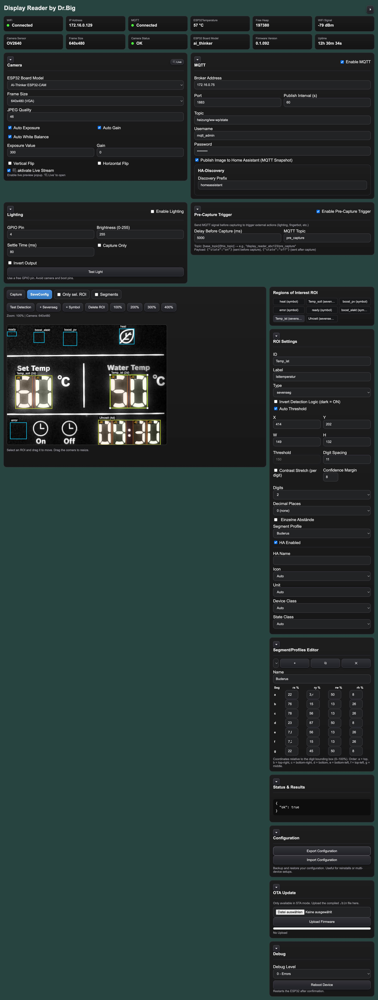

Die Oberfläche besteht aus mehreren aufklappbaren Funktionsbereichen:

| Nr. | Bereich |
|-----|---------|
| 1 | [Statusübersicht](#1--statusübersicht) |
| 2 | [Kameraeinstellungen](#2--kameraeinstellungen) |
| 3 | [MQTT Konfiguration](#3--mqtt-konfiguration) |
| 4 | [Beleuchtung](#4--beleuchtung) |
| 4b | [WS2812B LED](#4b--ws2812b-led) |
| 5 | [Pre-Capture Trigger](#5--pre-capture-trigger) |
| 6 | [Kameravorschau](#6--kameravorschau) |
| 7 | [ROI Liste](#7--roi-liste) |
| 8a | [Symbol ROI](#8a--symbol-roi) |
| 8b | [Seven-Segment ROI](#8b--seven-segment-roi) |
| 9 | [Home Assistant Integration](#9--home-assistant-integration) |
| 10 | [Segment/Profiles Editor](#10--segmentprofiles-editor) |
| 11 | [Status & Results](#11--status--results) |
| 12 | [Konfiguration Export/Import](#12--konfiguration-exportimport) |
| 13 | [OTA Update](#13--ota-update) |
| 14 | [Debug](#14--debug) |

---

## 1 – Statusübersicht

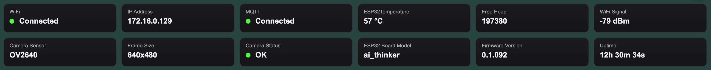

Der obere Bereich zeigt wichtige Systeminformationen auf einen Blick.

| Information | Beschreibung |
|-------------|-------------|
| WLAN Status | Verbindungsstatus und SSID |
| IP-Adresse | Aktuelle Netzwerkadresse |
| MQTT Status | Verbunden / getrennt |
| Temperatur | Interne Chip-Temperatur des ESP32 in °C |
| Freier Heap | Verfügbarer Arbeitsspeicher in Bytes |
| WLAN Signalstärke | RSSI-Wert in dBm |
| Kamerasensor | Erkannter Sensortyp |
| Auflösung | Aktive Bildgröße |
| Board Modell | Konfiguriertes ESP32-Board |
| Firmware Version | Aktuelle Softwareversion |
| Laufzeit | Betriebszeit seit letztem Neustart |

Dieser Bereich dient zur **Diagnose und Statuskontrolle** und ist schreibgeschützt.

---

## 2 – Kameraeinstellungen

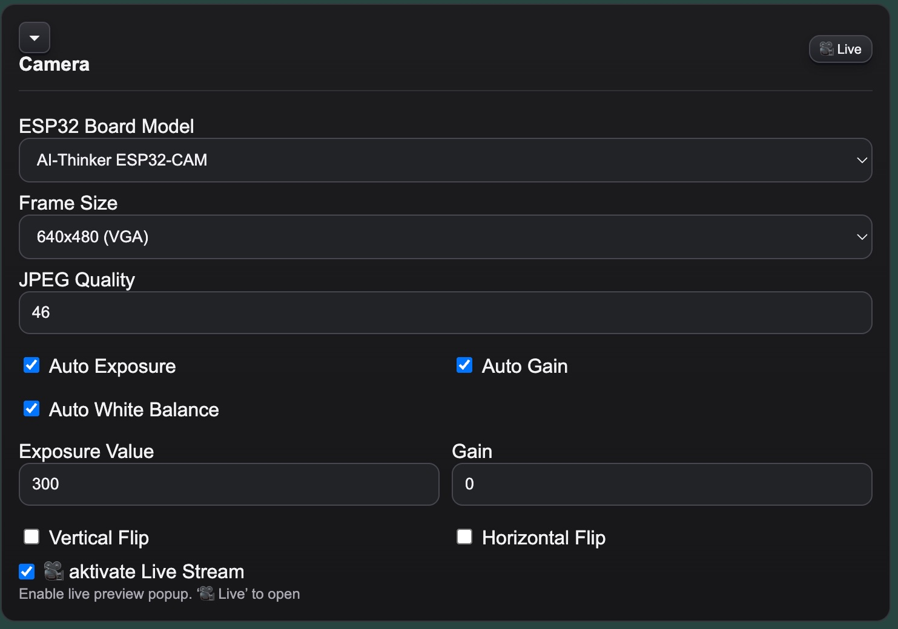

Konfiguration der angeschlossenen Kamera und ihrer Bildparameter.

**ESP32 Board Model**
Auswahl des verwendeten Kamera-Boards.

- AI Thinker ESP32-CAM
- ESP32 WROVER

**Frame Size**
Auflösung der Kameraaufnahme.

| Wert | Auflösung |
|------|-----------|
| QVGA | 320 × 240 |
| VGA | 640 × 480 |
| SVGA | 800 × 600 |

Niedrigere Auflösungen sind schneller und speichersparender.

> ⚠️ Der SVGA-Modus (800 × 600) kann je nach verwendeter Kamera zu Problemen führen (Bildfehlern, Abstürzen oder fehlgeschlagenen Aufnahmen). Empfohlen wird maximal **VGA (640 × 480)**.

**JPEG Quality**
Bildqualität des Kamerabildes (0 = niedrigste Qualität / kleinste Datei, 63 = höchste Qualität / größte Datei).

**Vertical Flip / Horizontal Flip**
Spiegelt das Bild vertikal oder horizontal, falls die Kamera verkehrt montiert ist.

**Auto Exposure / Auto Gain / Auto White Balance**
Automatische Anpassung von Belichtung, Verstärkung und Weißabgleich.

**Exposure Value / Gain**
Manuelle Feineinstellung der Belichtung und Signalverstärkung (nur aktiv wenn Automatik deaktiviert).
Exposure Value: `0–1200` · Gain: `0–30`.

**Publish Image to Home Assistant (MQTT Camera)**
Veröffentlicht regelmäßig ein Kamerabild als JPEG über MQTT.
Das Bild erscheint in Home Assistant als Kamera-Entity.

> ⚠️ Diese Funktion benötigt erhöhte Netzwerkbandbreite und Arbeitsspeicher.

**Enable Simple Stream (/stream)**
Aktiviert einen HTTP-Livestream der Kamera.
Über **Open Stream** kann der Stream direkt im Browser geöffnet werden, um die Kameraausrichtung zu prüfen.

> ⚠️ Änderungen werden erst nach **Save Config** dauerhaft gespeichert.

---

## 3 – MQTT Konfiguration

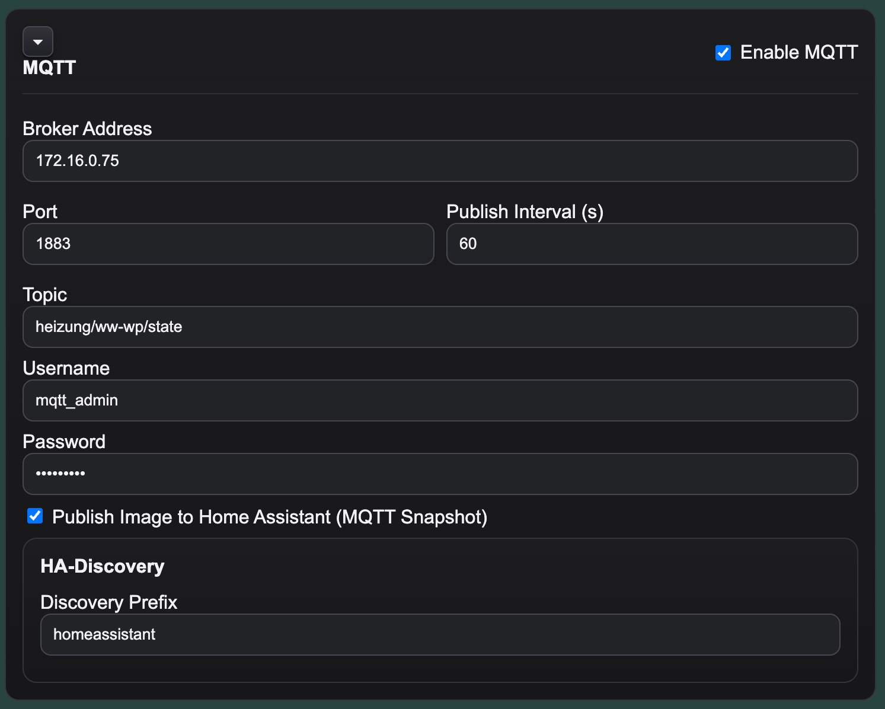

Verbindungseinstellungen zum MQTT-Broker.

**Enable MQTT**
Aktiviert die gesamte MQTT-Kommunikation.

**Broker Address**
IP-Adresse oder Hostname des MQTT-Servers.

**Port**
Standard: `1883`

**Publish Interval (s)**
Zeitintervall in Sekunden, in dem Bilder aufgenommen und Erkennungsergebnisse veröffentlicht werden.
Standardwert: `60`. `0` = kontinuierlich (so schnell wie möglich, keine Pause zwischen den Aufnahmen).

**Topic**
MQTT-Topic, unter dem die Ergebnisse veröffentlicht werden.

Beispiel:
```
heizung/display/state
```

**Username / Password**
Optionale Authentifizierung für gesicherte MQTT-Broker.

### Home Assistant Discovery Prefix

Standard: `homeassistant`

Unter diesem Prefix veröffentlicht das Gerät automatisch die benötigten **MQTT Auto Discovery Nachrichten**, sodass konfigurierte Sensoren automatisch in Home Assistant erscheinen.

**Device Name**
Name des Geräts, wie es in Home Assistant angezeigt wird. Wird beim [Config-Import](#12--konfiguration-exportimport) automatisch auf den gerätespezifischen Standardnamen zurückgesetzt und kann hier individuell angepasst werden.

> ⚠️ Änderungen werden erst nach **Save Config** dauerhaft gespeichert.

---

## 4 – Beleuchtung

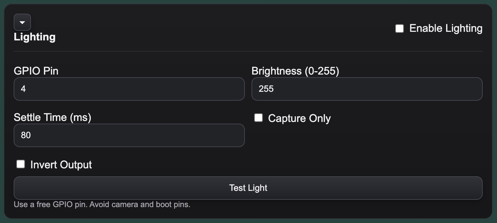

Steuerung einer optionalen Zusatzbeleuchtung zur besseren Displayerkennung.
Besonders hilfreich bei **LCD-Displays ohne eigene Hintergrundbeleuchtung**.

**Enable Lighting**
Aktiviert die Beleuchtungssteuerung.

**GPIO Pin**
GPIO-Pin zur Steuerung der LED oder Beleuchtungseinheit.
Bei AI-Thinker ESP32-CAM Boards typischerweise **Pin 4**.

**Brightness (0–255)**
Helligkeit der Beleuchtung über PWM.

**Settle Time (ms)**
Wartezeit nach dem Einschalten der Beleuchtung, bevor das Bild aufgenommen wird.
Ermöglicht dem Display Zeit zum Einschwingen.

**Capture Only**
Beleuchtung wird nur während der Bildaufnahme aktiviert, danach wieder abgeschaltet.

**Invert Output**
Invertiert das Steuersignal für aktive-Low Schaltungen (z. B. bei bestimmten Transistorschaltungen).

**Test Light**
Testet die Beleuchtung mit den aktuell eingestellten Parametern.

---

### 💡 Beleuchtungskonzepte nach Displaytyp

Die optimale Beleuchtung hängt stark vom jeweiligen Display ab. Ziel ist immer eine **gleichmäßige, reflexionsfreie Ausleuchtung** — Hotspots und Spiegelungen auf der Displayoberfläche sind die häufigste Ursache für schlechte Erkennungsraten.

#### Reflektives LCD (ohne Hintergrundbeleuchtung)
*Typisch: Thermostate, Heizungsregler, Wärmepumpen, Stromzähler*

Diese Displays reflektieren Umgebungslicht — direkte Frontbeleuchtung erzeugt fast immer Blendflecken.

**Empfohlene Ansätze (in Reihenfolge):**

1. **Ringförmige Beleuchtung um das Objektiv** (WS2812B LED oder LED-Ring): Licht trifft das Display aus vielen Winkeln gleichzeitig — Reflexionen verteilen sich gleichmäßig statt als Hotspot zu erscheinen. Helligkeit niedrig halten.
2. **Seitliche Beleuchtung** im flachen Winkel (20–40°): Streiflichttechnik lässt erhabene Segmente hell erscheinen, verhindert Frontreflexionen. Zwei LEDs von gegenüberliegenden Seiten für gleichmäßigere Ausleuchtung.
3. **Diffuse Beleuchtung**: LED hinter Milchglas, Butterbrotpapier oder weißem Kunststoff streut das Licht — kein Hotspot, gleichmäßige Fläche.

#### LCD mit Hintergrundbeleuchtung
*Typisch: Heizkessel, Wärmepumpen mit beleuchteten Displays*

Das Display leuchtet selbst — externe Beleuchtung ist oft kontraproduktiv und erzeugt Übersteuerung.

**Empfohlene Ansätze:**
- **Keine externe Beleuchtung** oder sehr schwach gedimmt
- **Capture Only** deaktiviert lassen (kein Lichtpuls nötig)
- Kameraposition so wählen dass kein Raumlicht auf das Display fällt (Abschirmung, Gehäuse)
- Kameraposition und Gehäuse so wählen, dass kein direktes Raumlicht auf die Displayscheibe fällt

#### Selbstleuchtende 7-Segment Anzeige (LED-Segmente)
*Typisch: Digitaluhren, Messgeräte, Schieblehren*

Segmente leuchten aktiv — Kontrast ist von Haus aus hoch.

**Empfohlene Ansätze:**
- **Keine externe Beleuchtung** — reduziert den natürlichen Kontrast
- Raumlicht abdunkeln oder Kamera abschirmen damit kein Fremdlicht auf das Display fällt
- Bei Überbelichtung durch helle Segmente: **JPEG Quality** reduzieren oder **Auto Gain** deaktivieren und manuell niedrig einstellen

---

### 💡 Allgemeine Montagehinweise

| Problem | Lösung |
|---------|--------|
| Hotspot / heller Fleck auf dem Display | Beleuchtungswinkel flacher machen oder Ring-LED verwenden |
| Gleichmäßigkeit schlecht | Diffusor (Milchglas, Papier) vor die LED setzen |
| Segmente kaum vom Hintergrund unterscheidbar | **Stretch Contrast** + **Auto Threshold** aktivieren |
| Raumlicht schwankt (Tages-/Nachtbetrieb) | **Capture Only** aktivieren: Licht nur während Aufnahme, konstante Bedingungen |
| Kamerabild zu hell / übersteuert | Brightness reduzieren, **Auto Exposure** deaktivieren, AEC-Wert manuell niedrig einstellen |
| Kamerabild zu dunkel | Settle Time erhöhen (Kamera braucht mehrere Frames zum Einregeln) |

> ⚠️ Änderungen werden erst nach **Save Config** dauerhaft gespeichert.

---

## 4b – WS2812B LED

Zweiter, unabhängiger Beleuchtungskanal für **WS2812B LED** — ideal zB. zur ringförmigen Montage um das Kameraobjektiv für schattenfreie, gleichmäßige Ausleuchtung.

Beide Beleuchtungskanäle (PWM und WS2812B) können gleichzeitig aktiv sein und werden unabhängig voneinander gesteuert.

**Enable WS2812B LED**
Aktiviert den WS2812B-Kanal.

**GPIO Pin**
Datenpegel-GPIO für den WS2812B-Dateneingang.

> ⚠️ WS2812B benötigt eine eigene 5 V Stromversorgung. Die LEDs dürfen nicht über den ESP32-GPIO mit Strom versorgt werden. Ein Level-Shifter (z. B. 74AHCT125) zwischen ESP32-GPIO (3,3 V) und WS2812B-Dateneingang (5 V) wird empfohlen.

> ℹ️ **AI-Thinker ESP32-CAM — empfohlener GPIO: 15**
> Auf dem AI-Thinker ESP32-CAM ist **GPIO 15** der zuverlässigste freie Pin für den WS2812B-Datenausgang. GPIO 15 ist als JTAG-Pin (MTDO) ausgeführt — die Firmware deaktiviert die JTAG-Alternativfunktion automatisch bei der Initialisierung. Andere scheinbar freie Pins haben folgende Einschränkungen:
>
> | GPIO | Problem |
> |------|---------|
> | 0 | XCLK der Kamera — nicht verwendbar |
> | 4 | Flash-LED (intern), Kameranutzung |
> | 12 | Strapping-Pin (beeinflusst Boot-Modus) |
> | 13 | JTAG MTCK — wie GPIO 15, aber weniger getestet |
> | 14 | JTAG TMS — Kamerakonflikt möglich |
> | 16 | PSRAM — nicht verwendbar |
> | **15** | ✅ **Empfohlen** — JTAG wird automatisch deaktiviert |

**LED Count**
Anzahl der LEDs (1–64).

**Brightness (0–255)**
Helligkeit der LEDs. Wird mit der gewählten Farbe multipliziert.

**Color**
Farbe der LEDs als Farbwähler (Standard: Weiß `#ffffff`).

**Settle Time (ms)**
Wartezeit nach dem Einschalten, bevor das Bild aufgenommen wird.

**Capture Only**
LED leuchtet nur während der Bildaufnahme, danach wieder aus.

**Test LED**
Testet die LED kurz mit den aktuell eingestellten Parametern.

> ⚠️ Änderungen werden erst nach **Save Config** dauerhaft gespeichert.

---

## 5 – Pre-Capture Trigger

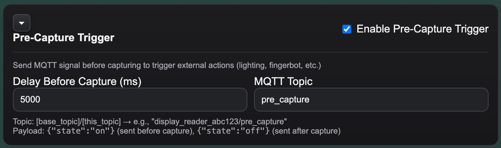

Der Pre-Capture Trigger ermöglicht es, vor jeder Bildaufnahme eine **MQTT-Nachricht zu senden**, um externe Aktionen auszulösen.

Anwendungsbeispiele:

- Externe Beleuchtung einschalten
- Relais aktivieren
- Fingerbot auslösen (zB. zum aktivieren Display)
- Home Assistant Automation starten

**Ablauf:**

1. MQTT-Nachricht `{"state":"on"}` wird an das konfigurierte Topic gesendet
2. System wartet die eingestellte Verzögerung
3. Bildaufnahme und Auswertung erfolgen
4. MQTT-Nachricht `{"state":"off"}` wird gesendet

**Enable Pre-Capture Trigger**
Aktiviert die Funktion.

**Delay Before Capture (ms)**
Wartezeit zwischen dem Senden des Triggers und der Bildaufnahme.

**MQTT Topic**
Topic, an das die Trigger-Nachrichten gesendet werden.

> ⚠️ Änderungen werden erst nach **Save Config** dauerhaft gespeichert.

---

## 6 – Kameravorschau

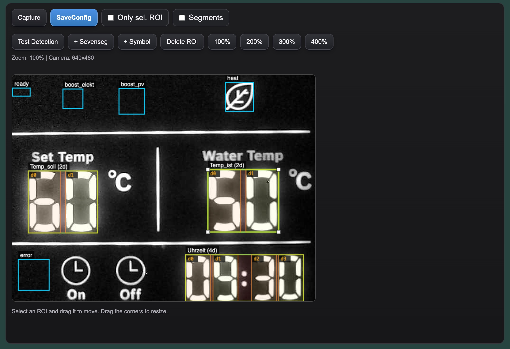

Das aktuelle Kamerabild wird hier angezeigt. ROI-Bereiche werden direkt im Bild als farbige Rahmen dargestellt und können **per Maus verschoben und skaliert** werden.

**Schaltflächen:**

| Schaltfläche | Funktion |
|--------------|----------|
| Capture | Nimmt ein neues Bild auf |
| Test Detection | Nimmt ein neues Livebild auf und führt sofortige Analyse durch — es wird **nicht** das angezeigte Vorschaubild verwendet |
| + Sevenseg | Erstellt eine neue ROI zur Ziffernerkennung |
| + Symbol | Erstellt eine neue ROI zur Symbolerkennung |
| Delete ROI | Löscht die aktuell ausgewählte ROI |
| Zoom + / − | Vergrößert oder verkleinert die Bildvorschau |
| Save Config | Speichert alle Einstellungen dauerhaft im Gerät |

> ⚠️ Änderungen werden erst nach **Save Config** dauerhaft gespeichert.

---

## 7 – ROI Liste

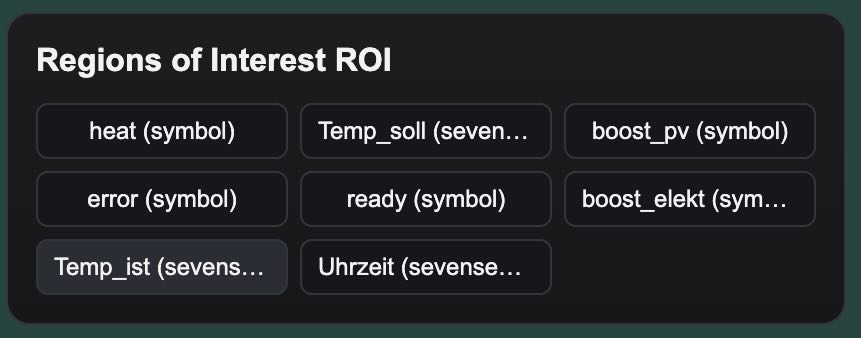

Zeigt alle definierten Regions of Interest (ROI) als Liste.

Durch Anklicken eines Eintrags wird die entsprechende ROI ausgewählt und ihre Einstellungen in den Sektionen 8a / 8b angezeigt. Die Auswahl ist auch direkt im Kamerabild möglich.

Für eine detaillierte Beschreibung aller ROI-Parameter siehe [📍 ROI Konfiguration](roi.md).

---

## 8a – Symbol ROI

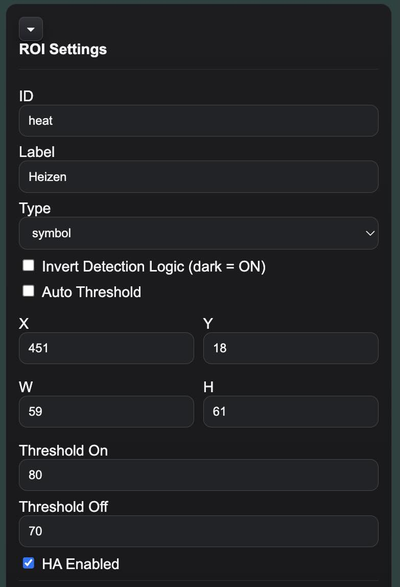

Wird zur Erkennung einzelner **Statussymbole** verwendet.
Das System bewertet, ob ein definierter Bildbereich hell oder dunkel ist, und leitet daraus einen Ein/Aus-Zustand ab.

Typische Anwendungen:

- Heizbetrieb aktiv
- Fehleranzeige
- Warmwasser verfügbar

**Parameter:**

| Parameter | Beschreibung |
|-----------|-------------|
| ID | Eindeutiger Name; wird als MQTT-Key und HA-Entity-ID verwendet |
| Label | Anzeigename im Interface |
| X / Y / W / H | Position und Größe im Kamerabild (Pixel) |
| Threshold On | Ab diesem Helligkeitswert gilt das Symbol als aktiv |
| Threshold Off | Unter diesem Helligkeitswert gilt das Symbol als inaktiv |
| Invert Detection Logic | Kehrt die Logik um (dunkel = aktiv) |
| Auto Threshold | Berechnet den Schwellwert automatisch aus dem Bildinhalt |

Für eine vollständige Parameterbeschreibung siehe [📍 ROI Konfiguration](roi.md).

> ⚠️ Änderungen werden erst nach **Save Config** dauerhaft gespeichert.

---

## 8b – Seven-Segment ROI

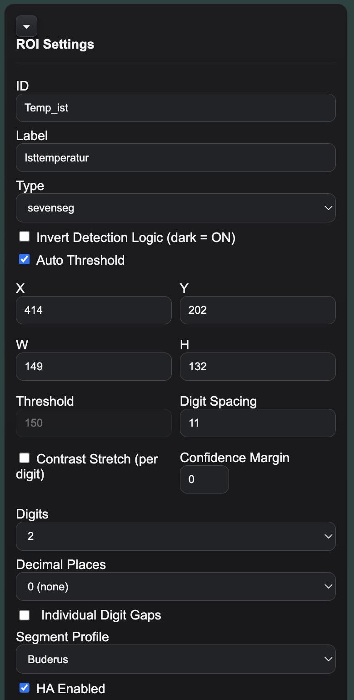

Wird zur Erkennung numerischer **7-Segment Anzeigen** verwendet.
Der definierte Bereich wird automatisch in einzelne Ziffern aufgeteilt und analysiert.

**Parameter:**

| Parameter | Beschreibung |
|-----------|-------------|
| ID | Eindeutiger Name; wird als MQTT-Key und HA-Entity-ID verwendet |
| Label | Anzeigename im Interface |
| Digits | Anzahl der Ziffern |
| Digit Spacing | Gleichmäßiger Abstand zwischen allen Ziffern in Pixel |
| Individual Digit Gaps | Aktiviert individuelle Abstände pro Lücke (überschreibt Digit Spacing) |
| Decimal Places | Anzahl der Dezimalstellen (0 = Ganzzahl) |
| Threshold | Helligkeitsschwelle zur Segmenterkennung |
| X / Y / W / H | Position und Größe im Kamerabild (Pixel) |
| Segment Profile | Verwendetes Segment-Layout (Standard oder benutzerdefiniert) |
| Invert Logic | Erkennt dunkle Segmente auf hellem Hintergrund |
| Auto Threshold | Automatischer per-Ziffer Gap-Threshold + Fuzzy-Match (empfohlen) |
| Stretch Contrast | Normalisiert den Kontrast im Bereich vor der Auswertung |
| Confidence Margin | Unsicherheitsbereich um den Schwellwert — bei Auto Threshold auf 0 lassen |

Für eine vollständige Parameterbeschreibung siehe [📍 ROI Konfiguration](roi.md).

> ⚠️ Änderungen werden erst nach **Save Config** dauerhaft gespeichert.

---

## 9 – Home Assistant Integration

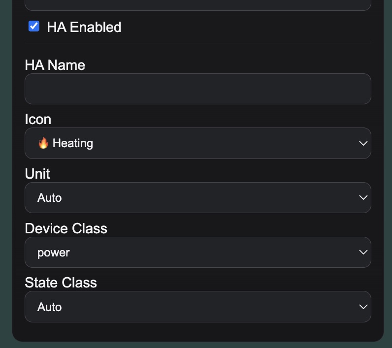

Wenn **HA Enabled** aktiviert ist, wird für diese ROI automatisch ein Sensor in Home Assistant registriert.
Das Gerät nutzt dafür die MQTT Auto Discovery.

**Parameter:**

| Parameter | Beschreibung |
|-----------|-------------|
| HA Enabled | Aktiviert Auto Discovery für diese ROI |
| HA Name | Anzeigename der Entität in Home Assistant |
| Icon | MDI-Icon (z. B. `mdi:thermometer`) |
| Unit | Einheit des Messwerts (z. B. `°C`, `%`, `W`) |
| Device Class | Sensor-Typ (z. B. `temperature`, `power`) |
| State Class | Interpretationsart (z. B. `measurement`, `total_increasing`) |

Weitere Details zur HA-Integration unter [🤖 Home Assistant](homeassistant.md).

> ⚠️ Änderungen werden erst nach **Save Config** dauerhaft gespeichert.

---

## 10 – Segment/Profiles Editor

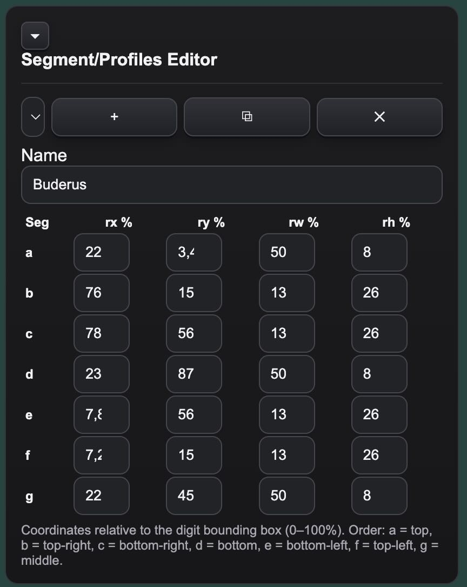

Der Segment/Profiles Editor ermöglicht die Anpassung des **Segment-Layouts** für unterschiedliche 7-Segment Displaytypen.

Jede Ziffer wird in 7 Segmente (a–g) aufgeteilt. Der Editor definiert, **wo sich jedes Segment relativ zur Zifferbounding-Box befindet** – als Prozentangabe (0–100 %).

**Funktionen:**

| Schaltfläche | Funktion |
|--------------|----------|
| Dropdown | Aktives Profil auswählen |
| + | Neues Profil erstellen |
| ⧉ | Aktives Profil duplizieren |
| ✕ | Aktives Profil löschen |

**Profil-Parameter (pro Segment a–g):**

| Spalte | Bedeutung |
|--------|-----------|
| rx % | Horizontale Position innerhalb der Ziffer (0 = links) |
| ry % | Vertikale Position innerhalb der Ziffer (0 = oben) |
| rw % | Breite des Messbereichs |
| rh % | Höhe des Messbereichs |

Das **Standard-Profil** ist schreibgeschützt und deckt typische 7-Segment Displays ab.
Eigene Profile können frei benannt, bearbeitet und einzelnen ROIs zugewiesen werden.

Wenn der Segment-Editor geöffnet und die **Segments**-Checkbox in der Kameravorschau aktiv ist, können Segmente auch direkt durch **Anklicken im Vorschaubild** ausgewählt werden. Ein erneuter Klick auf das gleiche Segment hebt die Auswahl auf.

Detaillierte Anleitung zur Profileditor-Nutzung und eigenen Profilen unter [🎛️ Segment-Profile](seg_profiles.md).

> ⚠️ Änderungen werden erst nach **Save Config** dauerhaft gespeichert.

---

## 11 – Status & Results

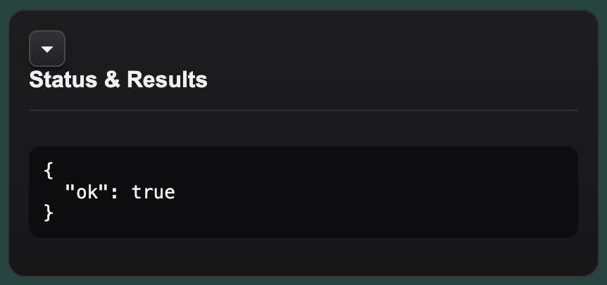

Zeigt das aktuelle Erkennungsergebnis als JSON-Ausgabe.

Nach **Test Detection** (Sektion 6) wird hier das vollständige Auswertungsergebnis mit Debug-Informationen angezeigt:

- Erkannte Werte aller ROIs
- Segmentzustände pro Ziffer (a–g)
- Durchschnittshelligkeit pro Segment
- Verwendeter Schwellwert
- Geometrie-Informationen

Nützlich zur **Überprüfung und Feinjustierung** von Schwellwerten, Positionen und Segment-Profilen.

Ausführliche Anleitung unter [🧪 Test & Debug](test_debug.md).

---

## 12 – Konfiguration Export/Import

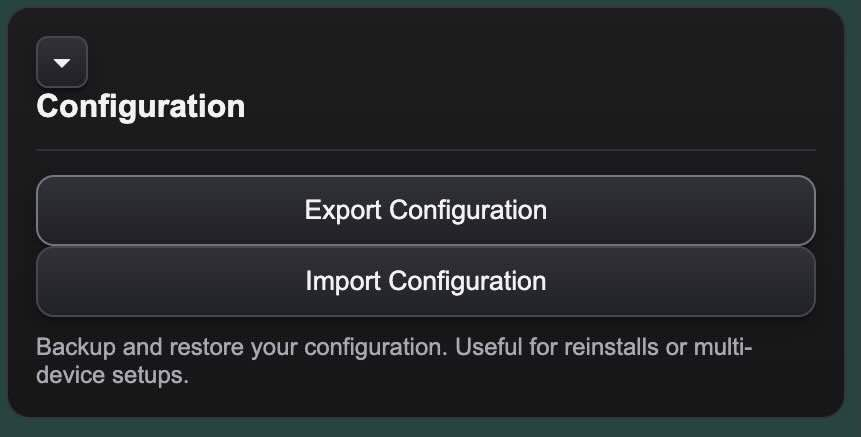

Sicherung und Wiederherstellung der vollständigen Gerätekonfiguration.

**Export Configuration**
Speichert die aktuelle Konfiguration als `.json`-Datei auf dem lokalen Rechner.

**Import Configuration**
Lädt eine zuvor gespeicherte Konfigurationsdatei auf das Gerät.

Beim Import werden alle Einstellungen übernommen — **mit Ausnahme der gerätespezifischen Felder**, die automatisch auf die Hardware-Werte des Zielgeräts zurückgesetzt werden:

| Feld | Verhalten beim Import |
|------|-----------------------|
| ROI-Konfiguration, Segment-Profile | ✅ wird übernommen |
| Kamera-, Belichtungs-, Beleuchtungseinstellungen | ✅ wird übernommen |
| MQTT-Broker-Adresse, Port, User/Passwort | ✅ wird übernommen |
| HA Discovery Prefix | ✅ wird übernommen |
| **Device Name** | ✅ wird übernommen — danach ggf. anpassen |
| **Device ID** | 🔒 wird zurückgesetzt (hardwarebasiert) |
| **MQTT Topic** | 🔒 wird zurückgesetzt (hardwarebasiert) |
| **WLAN Hostname** | 🔒 wird zurückgesetzt (hardwarebasiert) |

> 💡 So können mehrere Geräte dieselbe ROI- und Kamerakonfiguration teilen, ohne dass es zu MQTT-Kollisionen oder falschen Home Assistant Entities kommt. Nach dem Import nur noch den **Device Name** unter [MQTT Konfiguration → Home Assistant Discovery](#3--mqtt-konfiguration) anpassen.

---

## 13 – OTA Update

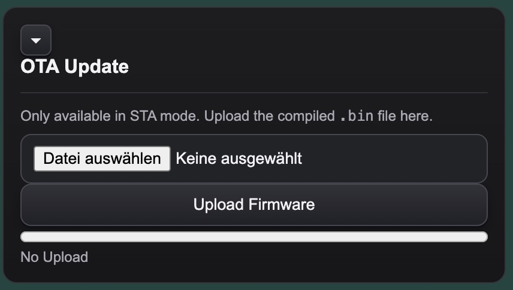

Firmware-Update direkt über das Webinterface ohne USB-Kabel.

> ⚠️ OTA Update ist nur im **STA-Modus** (normaler WLAN-Betrieb) verfügbar, nicht im AP-Setup-Modus.

> ⚠️ Es muss zwingend die Datei **`firmware-ota.bin`** verwendet werden — **nicht** `firmware.bin`. Die `firmware.bin` enthält Bootloader und Partitionstabelle und ist nur für den Erstflash per USB geeignet. Das OTA-Update mit `firmware.bin` schlägt mit dem Fehler `Wrong Magic Byte` fehl.

**Ablauf:**

1. Datei **`firmware-ota.bin`** auswählen
2. **Upload Firmware** klicken
3. Fortschrittsbalken beobachten
4. Gerät startet nach erfolgreichem Update automatisch neu

Die aktuelle Firmware-Version ist in der [Statusübersicht](#1--statusübersicht) einsehbar.

---

## 14 – Debug

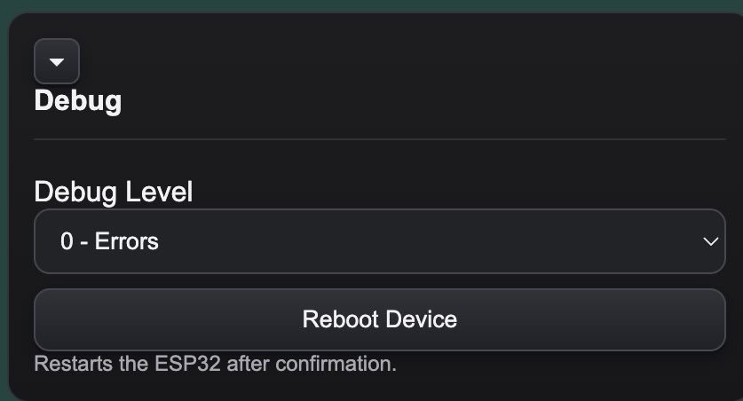

Systemnahe Einstellungen und Steuerung.

**Debug Level**
Steuert die Ausführlichkeit der Ausgabe auf der seriellen Konsole.

| Level | Ausgabe |
|-------|---------|
| 0 – Errors | Nur Fehler |
| 1 – Info | Fehler und wichtige Statusmeldungen |
| 2 – Debug | Vollständige Diagnoseausgabe |

**Reboot Device**
Startet den ESP32 neu. Eine Bestätigung ist erforderlich.

> 💡 Nicht gespeicherte Konfigurationsänderungen gehen beim Neustart verloren.

---

[⬆️ Nach oben](#webinterface)

> 📷 Alle Screenshots entstanden im Zusammenspiel mit einer **Buderus WPT260.4 AS** (Logatherm Warmwasser-Wärmepumpe).
